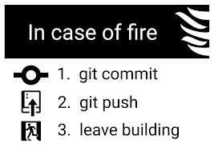

# Beauvoir-shoes

## Github

Cet exercice sera aussi l'occasion de réviser et de s'entraîner à l'utilisation de **Github**... Une fois que vous avez clôné ce repo, **renommez-le** et **supprimer le dossier** ``.git`` **présent à la racine**. Ensuite vous pourrez en faire un nouveau dossier relié à Github en écrivant en lignes de commande, dans **un terminal ouvert sur votre nouveau dossier** :
- ``git init``
- ``git add .``(attention à l'``espace``)
- ``git commit -m "initial commit"``

Une fois tout cela fait vous pourrez **créer le repo sur Github**, qui accueillera votre dossier, présent sur votre PC/Mac. Un conseil : donnez le même nom à votre dossier local et votre repo... Souvenez-vous : vous cliquez sur ``new`` dans Github pour créer un repo, vous choisissez de le créer en public ou privé, puis vous devrez copier/coller 3 lignes d'instruction depuis Github dans votre terminal, resté ouvert sur votre dossier local.

et maintenant rappelez-vous :

---

## keskilfofaire ?

Passons aux choses sérieuses...

Beauvoir lance son site de vente en ligne. Pour le moment le site est un peu rigide, car programmé uniquement en HTML/CSS... A vous d'apporter un peu de *dynamisme* dans tout ça :
- on regroupe les données dans un tableau **et on fait un commit/push**
- on découpe la page d'accueil en templates (sans casser le css...) **et on fait un commit/push**
- on récupère les données et on les affiches de façon dynamique (avec une [boucle](https://www.php.net/manual/fr/control-structures.foreach.php)) **et on fait un commit/push**

Des messages d'erreur ? ne baissez surtout pas les bras, c'est que vous êtes en bonne voie : votre code essaie d'être interprété, mais quelques détails l'en empêchent. Analysez bien les messages d'erreur, ils sont là pour vour vous aider et vous aiguiller sur ce qui ne passe pas :
- ``undefined variable`` : une variable n'est pas définie
- ``undefined offset`` : vous essayez d'appeler un index qui n'existe pas dans un tableau...

Et il y en a encore d'autres, mais prenez le temps de les lire pour les comprendre, et gardez patience !!
Ne croyez pas que votre code va fonctionner toujours du premier coup...

Après toutes ces épreuves, si vous êtes arrivés jusqu'ici, et que tout fonctionne sans problèmes, c'est déjà très bien.  **et on fait un commit/push**

---

    
Bonus : vous en voulez encore ?

Il est possible de donner l'extension ``.tpl`` à vos templates... essayez pour voir.
Les fichiers ayant pour extension ``.tpl`` sont un alias à "template" cette extension est utilisée pour les moteurs template en PHP notamment.

Les moteurs template que je recommande fortement car ils permettent de séparer la partie code de la partie HTML, grosso modo les codeurs travaillent sur les ``.php`` et autres... Et les graphistes sur des ``.tpl``. L'avantage est que si on change de thème pour son site on ne touche qu'au ``.tpl`` donc une maintenance plus facile, plus rapide et plus stable car les graphiste ne peuvent pas affecter le code PHP par exemple.

**Le commit/push est fait ?**

    
Super Bonus : vous êtes sûrs ?

Découpez toujours plus et utilisez un template pour afficher un article dans la liste

Souvenez-vous que la fonction [``include()``](https://www.php.net/manual/fr/function.include.php) permet d'inclure un fichier  ``PHP`` où vous voulez...

**Commit/push?**

Ok, on garde tout ça précieusement, pour retravailler dessus plus tard... il reste beaucoup de choses à faire.

